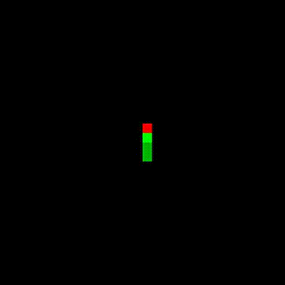

# Agent to solve snake game (But not actually)

## About
In this project we experimented with training AI for the simple snake game. We tried different architectures and RL algorithms. For now the best was PPO with CNN as a feature extraction layer.

## Setup

``` bash
pip install -r requirements.txt
```

## Demo(PPO + CNN best model)

<p align="center">
  
</p>